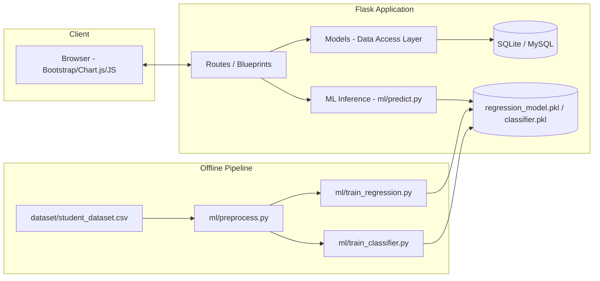
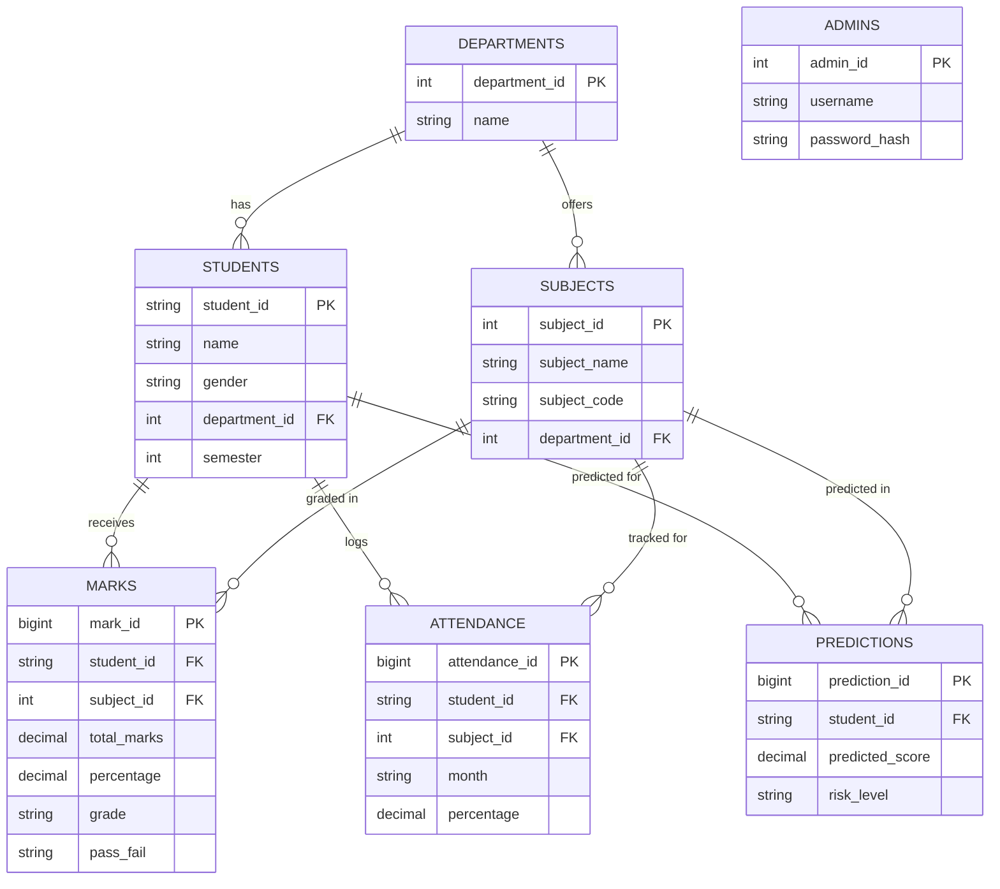

# 🎓 EduTrack AI — Student Exam Performance Tracker

A production-style, full-stack web application for schools and colleges to manage student records, marks, attendance, and generate **AI-powered performance predictions** using machine learning.

Built with **Flask · SQLite/MySQL · Scikit-learn · Chart.js · Bootstrap 5**.

---

## 📌 Project Abstract

EduTrack AI is an end-to-end academic performance management system that digitizes the entire lifecycle of student assessment — from marks entry and attendance tracking to automatic grade calculation, reporting, and predictive analytics. Its machine learning core uses **Random Forest Regression** to forecast a student's next exam score and a **Random Forest Classifier** to predict pass/fail outcomes, enabling institutions to identify at-risk students early and intervene proactively.

## 🎯 Problem Statement

Most colleges still track exam performance in disconnected spreadsheets with no predictive insight into which students are likely to struggle. Faculty discover failing students only after results are published — too late to help. EduTrack AI solves this by combining structured data management with an AI layer that flags risk **before** the final exam happens.

## 🎯 Objectives

- Centralize student, subject, marks and attendance records in one system
- Automate total/percentage/grade/GPA/rank/pass-fail calculation
- Provide a real-time analytics dashboard for administrators
- Predict future exam performance and risk of failure using ML
- Generate exportable report cards and institutional reports (PDF/CSV/Excel)
- Ship a clean, modular, secure, and scalable codebase

---

## 🧰 Technology Stack

| Layer | Technology |
|---|---|
| Frontend | HTML5, CSS3 (custom design system), Bootstrap 5, JavaScript (ES6) |
| Backend | Python 3, Flask, Jinja2 |
| Database | SQLite (bundled, zero-config) / MySQL 8 (production script included) |
| Machine Learning | Pandas, NumPy, Scikit-learn (RandomForestRegressor & RandomForestClassifier), Joblib |
| Visualization | Chart.js |
| Reporting | ReportLab (PDF), OpenPyXL (Excel), Pandas (CSV) |
| Icons | Font Awesome 6 |
| Auth | Werkzeug password hashing, server-side sessions |

---

## 🏗️ Architecture



The app follows an **MVC-inspired, modular Flask Blueprint architecture**:

```
app.py            → Application factory, blueprint registration, admin seeding
config.py         → Environment-driven configuration
models/           → Data access layer (parameterized SQL — no string-built queries)
routes/           → Flask Blueprints (controllers): auth, students, subjects,
                    marks, attendance, reports, analytics, prediction
ml/               → Preprocessing, feature engineering, training, evaluation, inference
templates/        → Jinja2 views (server-rendered, Bootstrap 5 + custom design system)
static/           → CSS / JS / images / uploads
```

---

## 🗄️ Database Design

Full schema: [`database.sql`](database.sql) (MySQL 8, InnoDB, normalized to 3NF, with primary/foreign keys and indexes).
The bundled app uses an equivalent **SQLite** schema (`models/db.py`) for zero-config local runs.

### Entity Relationship Diagram



**Marks formula (out of 130):** `Assignment(20) + Quiz(10) + Lab(20) + Internal(20) + Project(10) + Final Exam(50)`

**Grading scale:** A+ ≥90 · A ≥80 · B+ ≥70 · B ≥60 · C ≥50 · D ≥40 · F <40 (also requires Final Exam ≥15 to pass).

---

## 🤖 Machine Learning Workflow

1. **`ml/preprocess.py`** — loads `dataset/student_dataset.csv`, cleans nulls/duplicates, label-encodes Pass/Fail
2. **`ml/feature_engineering.py`** — derives Engagement Score, Consistency Score, and a heuristic At-Risk flag
3. **`ml/train_regression.py`** — trains a `RandomForestRegressor` (300 trees) to predict `Final_Exam_Marks`; reports MAE / RMSE / R²
4. **`ml/train_classifier.py`** — trains a `RandomForestClassifier` (300 trees, balanced classes) to predict `Pass_Fail`; reports Accuracy, Precision, Recall, F1, Confusion Matrix, ROC-AUC, and per-feature importance
5. **`ml/evaluate.py`** — CLI report of the above metrics (also surfaced live on the **Analytics** page)
6. **`ml/predict.py`** — inference layer used by the `/prediction` routes; returns predicted score, pass/fail label, confidence %, fail probability, and a Low/Medium/High risk tier

Features used by both models: `Attendance, Study_Hours, Assignment_Marks, Quiz_Marks, Lab_Marks, Internal_Marks, Previous_Semester_Marks, Project_Marks`.

Retrain any time your data changes:
```bash
python ml/train_regression.py
python ml/train_classifier.py
```

---

## 📦 Project Structure

```
AI_Student_Exam_Performance_Tracker/
├── app.py                     # Flask entrypoint / application factory
├── config.py                  # Environment configuration
├── requirements.txt
├── database.sql               # MySQL production schema + seed data
├── seed_data.py                # Loads dataset/student_dataset.csv into the app DB
├── gen_dataset.py              # Regenerates the synthetic dataset (500+ rows)
├── .env.example
├── README.md
│
├── dataset/
│   └── student_dataset.csv     # 500 synthetic student-subject records
│
├── ml/
│   ├── preprocess.py
│   ├── feature_engineering.py
│   ├── train_regression.py
│   ├── train_classifier.py
│   ├── predict.py
│   ├── evaluate.py
│   ├── utils.py
│   ├── regression_model.pkl
│   ├── classifier.pkl
│   ├── label_encoder.pkl
│   └── metrics.json
│
├── models/                     # Data access layer + business logic
│   ├── db.py
│   ├── student.py
│   ├── subject.py
│   ├── marks.py
│   ├── attendance.py
│   ├── admin.py
│   └── calculations.py
│
├── routes/                     # Flask Blueprints (controllers)
│   ├── auth.py
│   ├── main.py
│   ├── students.py
│   ├── subjects.py
│   ├── marks.py
│   ├── attendance.py
│   ├── reports.py
│   ├── analytics.py
│   ├── prediction.py
│   └── decorators.py
│
├── templates/                  # 20 Jinja2 views (login, dashboard, CRUD, reports...)
├── static/
│   ├── css/style.css
│   └── js/main.js
├── instance/                   # SQLite database file lives here (auto-created)
└── logs/                       # Application + ML logs (auto-created)
```

---

## 🚀 Installation Guide

### Prerequisites
- Python 3.10+
- pip

### Steps

```bash
# 1. Extract the ZIP and enter the project folder
cd AI_Student_Exam_Performance_Tracker

# 2. (Recommended) create a virtual environment
python -m venv venv
source venv/bin/activate        # Windows: venv\Scripts\activate

# 3. Install dependencies
pip install -r requirements.txt

# 4. (Optional) copy environment file
cp .env.example .env

# 5. Populate the database with the sample dataset (500+ records)
python seed_data.py

# 6. Train the AI models (only needed once — .pkl files are already included)
python ml/train_regression.py
python ml/train_classifier.py

# 7. Run the application
python app.py
```

Open **http://localhost:5000** and log in with:

```
Username: admin
Password: Admin@123
```

> ⚠️ Change the default password immediately from **Profile → Change Password** after your first login.

The SQLite database file is created automatically at `instance/student_tracker.db` — no external database server is required to run the project.

---

## 🏭 Production Deployment Guide

### Option A — Keep SQLite (small deployments)
Run behind a production WSGI server:
```bash
pip install gunicorn
gunicorn -w 4 -b 0.0.0.0:8000 app:app
```
Put Nginx or Caddy in front for TLS termination and static file caching.

### Option B — Switch to MySQL (recommended for multi-user production)
1. Create the schema:
   ```bash
   mysql -u root -p < database.sql
   ```
2. Set environment variables in `.env`:
   ```
   DB_ENGINE=mysql
   MYSQL_HOST=your-db-host
   MYSQL_USER=your-db-user
   MYSQL_PASSWORD=your-db-password
   MYSQL_DB=student_tracker
   ```
3. Install a MySQL driver (`pip install mysql-connector-python`) and point `models/db.py`'s
   connection function at MySQL instead of SQLite (the query layer already uses parameterized
   `?`/`%s` placeholders throughout, so the swap only touches the connection helper).
4. Set `SECRET_KEY` to a long random value and `FLASK_ENV=production`.
5. Deploy with Gunicorn + Nginx, or containerize with Docker.

---

## 🔌 API / Route Reference

All routes below (except `/login`) require an authenticated admin session.

| Method | Route | Description |
|---|---|---|
| GET/POST | `/login` | Admin login |
| GET | `/logout` | End session |
| GET | `/` | Dashboard with live stats & charts |
| GET | `/students/` | List students (search, filter, paginate) |
| GET/POST | `/students/add` | Create student |
| GET/POST | `/students/<id>/edit` | Update student |
| POST | `/students/<id>/delete` | Delete student |
| GET | `/students/<id>/profile` | Student detail view |
| GET | `/subjects/` | List subjects |
| GET/POST | `/subjects/add` \| `/subjects/<id>/edit` | Manage subjects |
| GET | `/marks/` | View all marks (filterable) |
| GET/POST | `/marks/entry` | Enter marks (auto-calculates total/%/grade/pass-fail) |
| GET/POST | `/attendance/` | Log monthly attendance |
| GET | `/reports/report-card/<id>` | HTML report card |
| GET | `/reports/report-card/<id>/pdf` | **PDF** report card download |
| GET | `/reports/semester/export/<csv\|excel>` | **CSV/Excel** semester export |
| GET | `/analytics/` | Charts + full ML evaluation metrics |
| GET/POST | `/prediction/` | Run a live AI prediction for a student/subject |
| GET | `/prediction/risk-analysis` | Batch at-risk student report |

---

## 🔐 Security Notes

- Passwords hashed with Werkzeug's `generate_password_hash` (PBKDF2)
- All SQL uses parameterized queries — no string-concatenated SQL anywhere
- Session cookies are `HttpOnly` and `SameSite=Lax`; `Secure` in production config
- Server-side form validation on every create/update route
- `login_required` decorator protects all authenticated routes
- Errors are logged to `logs/app.log` / `logs/ml.log`, never leaked to the client in production mode

---

## 📸 Screenshots

Run the app and visit these routes to see the UI:
- `/` — Dashboard (stat cards, semester trend, pass-rate gauge, grade distribution)
- `/students/` — Student directory with search/filter/pagination
- `/prediction/` — Live AI prediction panel
- `/analytics/` — Full ML evaluation suite (confusion matrix, ROC AUC, feature importance)

*(Add your own screenshots here after running the app locally — e.g. `static/images/screenshot-dashboard.png`.)*

---

## 🔮 Future Scope

- Role-based access (teacher vs. admin vs. student self-service portal)
- Email/SMS alerts to guardians for at-risk students
- Deep learning (LSTM) for multi-semester trend forecasting
- REST/JSON API layer for a mobile companion app
- Bulk import of marks/students via CSV upload
- Multi-tenant support for multiple institutions

---

## 📄 License

Released under the [MIT License](LICENSE).

---

## 🙌 Credits

Built as a complete, resume-ready full-stack + machine learning reference project: Flask backend,
custom-designed Bootstrap 5 dashboard, and a real Random Forest–based prediction pipeline trained
on a 500-record synthetic academic dataset.
